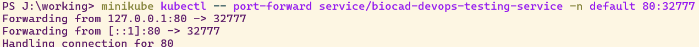

# Тестовое задание на devops стажировку в BIOCAD

### Вопросы

1. *Чем git pull отличается от git fetch?*

git fetch загружает изменения из удаленного репозитория для remote-tracking веток в локальный, но не применяет их к рабочей копии. 
git pull же загружает изменения и сразу применяет их к рабочей копии, делая git fetch и затем автоматом git merge.

2. *Какие модели ветвления git существуют?*

Существует множество разнообразных моделей ветвления в git. 
Самые распространенные модели: Git Flow, GitHub Flow, GitLab Flow, Forking Workflow и другие, ну и централизованный воркфлоу, без ветвления, но с использованием единого репозитория тоже в какой-то мере можно назвать моделью ветвления. 
Каждая из них имеет свои плюсы и минусы, выбор модели зависит от конкретного проекта и коропративных правил. 
Например, Git Flow подходит для больших и сложных проектов, где требуется строгая организация релизов и поддержка стабильных версий. 
В Git Flow создается несколько веток по типу работы - main, develop, feature, release и т.д  GitHub Flow подходит для небольших команд, где важнее скорость разработки и частая интеграция кода и нет необходимости поддерживать несколько версий. 
В GitHub Flow в main только код готовый для прода, а остальные ветки являются feature ветками для новых фич и фиксов.


3. *Чем в linux отличается soft link от hard link? Какое поведение будет при удалении файла оригинала? Можно ли создать hardlink на директорию?*

В Linux есть hard links и soft (symbolic) links. 
Hard link - это ссылка, которая указывает на inode (набор данных в файловой системе). 
Soft links указывают на путь к файлу. 
Hard links не могут ссылаться на файлы вне своей файловой системы, в отличие от soft links. 
Если оригинальный файл удалён, данные продолжат существовать в файловой системе, пока не удалены все hard links, указывающие на этот inode. 
Если говорить про soft links, то при удалении оригинала ссылка ломается, однако если создать новый файл с таким же именем и расположением, soft link будет поинтить на него. 
Hard links не могут быть созданы на директории.

4.  *Как проверить сетевую доступность между двумя linux машинами?*

Можно использовать утилиту ping, которая отправляет ICMP-пакеты на указанный IP-адрес и ожидает ответа. 
Ответ получен - сетевое соединение между машинами работает. 
Еще можно использовать утилиту telnet, которая устанавливает TCP-соединение на указанный порт и проверяет его доступность. 
Если соединение установлено, значит, сетевое соединение между машинами работает. 
Также подойдет использование утилиты traceroute, которая отображает маршрут, по которому пакеты достигают указанного IP-адреса. 
Если пакеты достигают цели, значит, сетевое соединение между машинами работает. 

5. *Чем контейнер отличается от виртуальной машины?*

    Контейнер и виртуальная машина по разному отвечают на требования виртуализации. 
    Фундаментальная разница в компонентах, которые подвергаются изоляции от других частей системы.
    VMs виртуализируют всю систему, включая hardware и software слои, в то время как контейнеры виртуализируют только software слой. 
    Для VMs характерна эмуляция CPU, partitions, сетевых сервисов. Они используют hypervisors, которые координируют управление ресурсами  между хостом и VM.
    Конетйнеры используют runtime (такой как Docker Engine).
    Контейнеры гораздо более легковесны по сравнению с VMs, в то время как VMs дают больший контроль за окружением.
    Контейнеры более гибкие и миграция с ними составляет меньше головной боли.

6. *На каких компонентах Linux основана контейнеризации в Docker?*

Docker использует Linux namespaces для создания изолированной среды для контейнера.
Когда мы запускаем контейнер, Docker создает набор namespaces для этого контейнера.
Элементы контейнеров работают в отдельных namespaces и их права ограничены этими namespaces.
Кроме namespaces, Docker использует cGroups, union file systems (UFS).
сGroups определяют ограничения на использование ресурсов (CPU, memory, I/O) для контейнеров.
UFS позволяет получить доступ к нескольким файловым системам из одной, что позволяет создавать слои для образов контейнеров.

7. *Опишите составные части архитектуры Docker*

Docker Client, Docker Engine, Docker Registries и Docker objects - составные части архитектуры Docker.
Docker Engine, пожалуй, самый важный компонент, который состоит из сервера, Rest API и CLI. 
Сервер - он же docker daemon, он же dockerd, создаёт и управляет образами, контейнерами, сетями и т.д.
Rest API передает набор инструкций серверу.
Ну а коммандная строка позволяет юзеру вводить эти самые инструкции. (В случае Docker Desktop это можно делать с помощью GUI).
Docker Client позволяет юзеру коммуницировать с Docker, при этом может коммуницировать с несколькми daemons одновременно.
Registiries бывают публичными и приватными, в них хранятся образы (например дефолтный Docker Hub).
Docker objects - это образы, контейнеры, сети, тома и т.д., которые создаются и управляются с помощью Docker Engine.

8. *Как устроен образ контейнера?*

Образ контейнера позволяет воспроизводить идентичные контейнеры на разных машинах, и является стандартизированным пакетом, включающим файлы, конфигурации, binaries, библиотеки для запуска контейнера.
Образы неизменяемы и состоят из слоёв, где каждый слой представляет собой набор изменений файловой системы, которые добавляют, удаляют или изменяют файлы.


9. *Почему вместо "COPY . . / RUN npm install" рекомендуют делать "COPY package.json / RUN npm install / COPY . ."* 

Копирование package.json перед выполнением npm install позволяет использовать кеширование Docker. 
Если package.json не изменился, то Docker не будет повторно выполнять команду npm install, а будет использовать кешированный результат. 
Это может значительно ускорить сборку образа, особенно если в проекте много зависимостей. 
Если деалть по первому сценарию, то при изменении хоть одного файла, Docker пересобирает все последующие слои, включая RUN npm install, даже если package.json не изменился.

10. *Что такое под в Kubernetes? Могут ли два контейнера внутри одного пода слушать один и тот же порт?*

Pod это наименьший deployable элемент в k8s. Pod это группа контейнеров, у которых одно хранилище и сетевые ресурсы, а так же спецификации как запускать эти контейнеры.
Два контейнера внутри одного пода не могут слушать один и тот же порт из-за общих сетевых ресурсов.

11. *Какие виды JOIN знаете и чем они отличаются?*

Знаю inner join (он же просто join), left join, right join, full join и cross join.
Inner join возвращает те строки, которые присутствуют и в обеих соединяемых таблицах.
Left join возвращает все строки из левой таблицы и соответствующие строки из правой таблицы, если они есть, и NULL, если нет.
Right join возвращает все строки из правой таблицы и соответствующие строки из левой таблицы, если они есть, и NULL, если нет.
Full join возвращает все строки из обеих таблиц, и соответствующие строки из другой таблицы, если они есть, и NULL, если нет.
Cross join возвращает декартово произведение двух таблиц, то есть каждую строку из левой таблицы соединяет со всеми строками из правой таблицы.

12. *Что такое having в SQL запросе? Чем отличается от where?*

Having это по сути аналог where для агрегированных результатов. Where фильтрует данные до агрегации, а having фильтрует результаты агрегации. 

### Задание

1. Элементарное web приложение "hello world" было написано мною на Python с помощью FastAPI. Оно доступно в это репо как app.py. 
Оно состоит из одного get запроса, возвращающего hello world.


2. Уже был установлен Docker Desktop.

3. Был собран и опубликован контейнер на Docker Hub. 

Ссылка: https://hub.docker.com/r/avigdornir/hello_world_biocad_testing

4. Был установлен minikube и развернут кластер.


5. Был создан деплоймент с 2 репликами моего приложения. deployment.yaml доступен в этом репо. 


6. Был создан сервис NodePort, дающий доступ к подам. Я решил оставить его манифест в том же deployment.yaml, доступном в этом репо.

7. Был включен режим проброса портов и осуществлено подключение через мой браузер с помощью команды:

```
 minikube kubectl -- port-forward service/biocad-devops-testing-service -n default 80:32777
```




8. Ну собственно вот это репо)

9. Cхема: 


